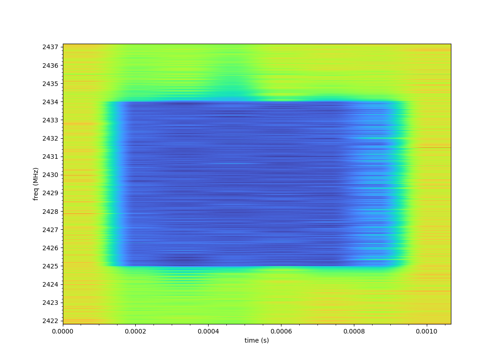

# samples2djidroneid
Decode DJI DroneID from I/Q samples

# Overview

This project, based on the work in [proto17/dji_droneid](https://github.com/proto17/dji_droneid) and [kismet](https://github.com/kismetwireless/kismet/blob/master/dot11_parsers/dot11_ie_221_dji_droneid.h), allows decoding [DJI DroneID](https://petapixel.com/assets/uploads/2022/08/Anatomy-of-DJI-Drone-ID-Implementation1.pdf) frames from a recording made with an SDR. DJI DroneID frames, which can be transmitted by different RF transports (e.g. WiFi, Occusync), are not encrypted and reveal the drone's serial number, position, and the position of the controller. Currently only Occusync 2.0 is decoded.



# Usage

1. Make an SDR recording in complex, float32 format, at 15.36e6 samples/sec (or higher, see below), of a frequency likely to be in use by DroneID. The algorithm for which frequencies are used is not documented, but it has been observed that if the drone is set to manually use the 5GHz band for video, then DroneID frames will appear at 2.4295GHz among others in the 2.4G band. The recording's center frequency does not have to match that of the DroneID frames as long as the entire frame is captured.
2. Build ```samples2djidroneid```:
```
docker build -f Dockerfile . -t samples2djidroneid
```
3. Run ```samples2djidroneid``` (where ```single_droneid_gain40_1_2429500000Hz_15360000sps.raw``` is the recording):
```
$ docker run -v /tmp:/tmp -ti samples2djidroneid /tmp/single_droneid_gain40_1_2429500000Hz_15360000sps.raw
{"framelen": 88, "msgtype": 16, "version": 2, "seqno": 15, "state_info": 7943, "serial_no": "REDACTED", 
"longitude": REDACTED, "latitude": REDACTED, "height": REDACTED, "altitude": REDACTED, 
"velocity_north": 0, "velocity_east": 0, "velocity_up": 0, "yaw": 2.5275760960625524, 
"phone_app_gps_time": 1657086670618, "phone_app_latitude": REDACTED, 
"phone_app_longitude": REDACTED, "home_latitude": REDACTED, "home_longitude": REDACTED, 
"product_type": 63, "uuid_length": 19, "uuid": "REDACTED", "null": 0, "crc": 8143}
```

# Current limitations

* Due to limitations in the dji_droneid decoder, only specific sample rates which devide evenly by LTE carrier spacing (15e3Hz) into power-of-two FFT sizes are supported (practically speaking, only 15.36e6 and 30.72e6 sps are supported - the DroneID frame is approximately 10MHz - at 15.36e6 the FFT size is 1024).
* DroneID frame detection may be quite slow where there is co-channel interference with non-DroneID transmitters (e.g older WiFi). Use the smallest sample recording possible.

